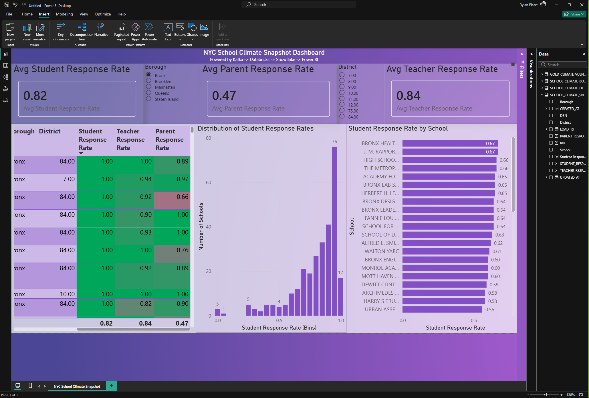

# NYC School Climate Snapshot Dashboard

This dashboard provides a clean, interactive view of NYC school climate survey engagement, powered by a modern real-time data engineering pipeline.
It showcases how student, parent, and teacher response rates vary across districts and boroughs and enables quick comparative analysis using slicers and visual filters.



---

## **Purpose**

The goal of this dashboard is to demonstrate how raw survey data can be transformed into an **analysis-ready interactive BI experience** using:

* **Kafka** → real-time ingestion
* **Databricks** → bronze/silver transformations
* **Snowflake** → gold-layer analytics tables
* **Power BI** → clean, branded visualization

The dashboard provides both system-level and school-level engagement insights.

---

## **Key Features**

### **1. KPI Overview Cards**

At the top of the dashboard:

* **Avg Student Response Rate**
* **Avg Parent Response Rate**
* **Avg Teacher Response Rate**

Each KPI is styled consistently with branded transparency and centered callouts.

---

### **2. Interactive Slicers**

Users can filter the entire dashboard by:

* **Borough**
* **District Number**

Slicers dynamically update all visuals, enabling targeted regional analysis.

---

### **3. Student Response Distribution (Histogram)**

A clean histogram shows how many NYC schools fall into each student response rate bin:

* Reveals the skew toward high student participation
* Useful for quickly diagnosing system-wide engagement health

---

### **4. Student Response Rate by School (Bar Chart)**

A sortable bar chart highlights:

* Highest-engagement schools
* Schools with low student participation
* Trends within districts/boroughs

This can be used to identify outliers or check for consistent patterns across regions.

---

### **5. School Climate Heatmap**

A heatmap table displays:

* **Student Response Rate**
* **Teacher Response Rate**
* **Parent Response Rate**

Heatmap coloring:

* 🟩 Green → High engagement
* 🟧 Yellow → Medium engagement
* 🟥 Red → Low engagement

This visual immediately conveys **response gaps and equity implications** across schools.

---

## **Technology Stack**

This dashboard is powered by an end-to-end modern data stack:

| Layer     | Technology               | Purpose                           |
| --------- | ------------------------ | --------------------------------- |
| Ingestion | **Apache Kafka**         | Real-time survey stream ingestion |
| Bronze    | **Databricks / GCP**     | Landing raw records from Kafka    |
| Silver    | **Databricks / PySpark** | Schema cleaning, normalization    |
| Gold      | **Snowflake**            | Aggregations + analytics tables   |
| BI        | **Power BI (2025)**      | Interactive visualization         |

---

## **Repository Structure**

```text
powerbi/
  exports/
    school_climate_snapshot.png      # Exported dashboard screenshot
    NYC_Climate_Snapshot.pbix        # Full Power BI report file
```

---

## **Insights**

* Student response rates are **strong city-wide** (~82%).
* Teacher engagement is also consistently high (~84%).
* Parent response rates lag behind (~47%), revealing an **outreach gap**.
* Response rate distribution is **right-skewed**, indicating many schools capture high participation.
* Heatmap reveals pockets of lower engagement—often tied to district or borough variation.

---

## **Future Work**

A planned SVI (Social Vulnerability Index) context page will incorporate community vulnerability measures.
This requires:

* Cleaning SVI `-999` suppression codes
* Adding census tract → district crosswalk
* Aggregating SVI values to district/borough level
* Joining SVI metrics with Gold climate tables

This will allow **equity-focused** climate analysis in future iterations.

---

## Summary

This dashboard represents a complete BI deliverable built on top of a full data engineering pipeline.
It demonstrates:

* Technical ability to ingest, transform, and model data
* BI visualization skills
* Clean theming and UX design
* Ability to tell a data story through interactive analytics

It showcases the need for **Data Engineering**, **Analytics Engineering**, and **BI Engineering** capabilities.
